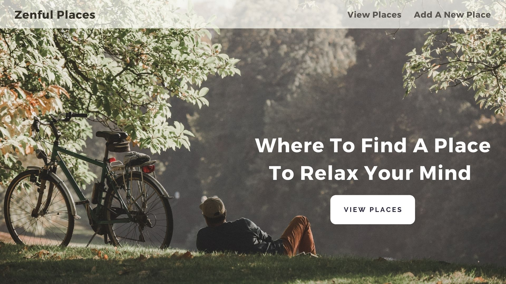
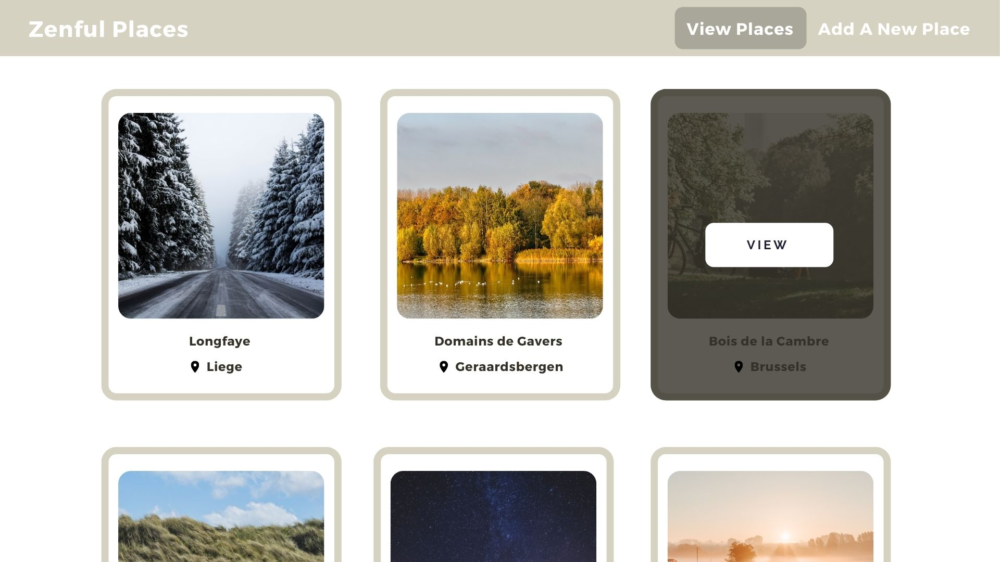
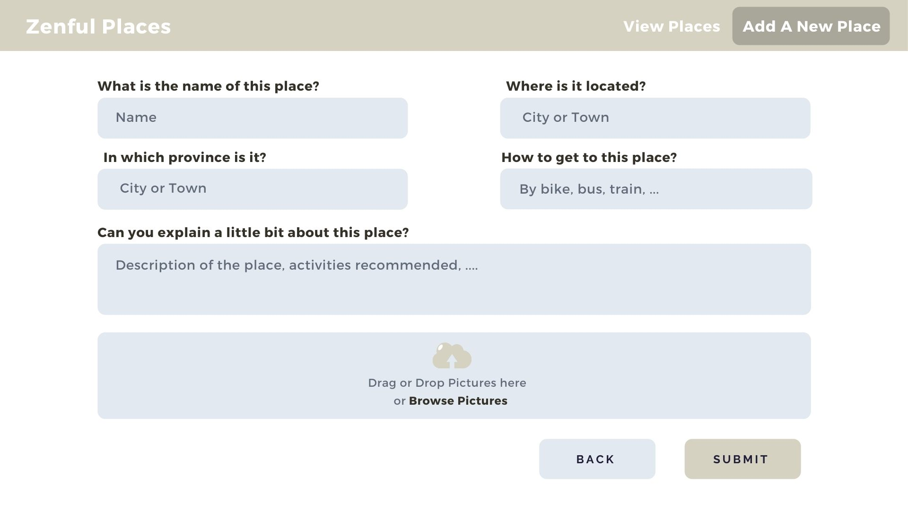
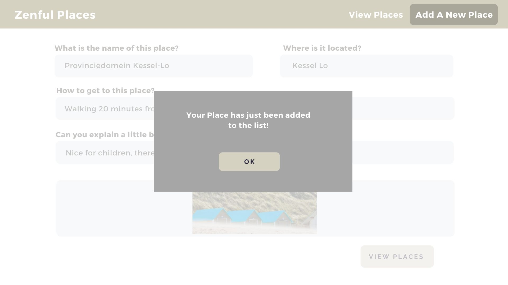

1. On Landing Page, user can see the information about the page, a navigation bar of View Places and Add A New Place
2. On Landing Page, user can see a visual and click on a ‘View All Places’ button on above section (above the fold; on visual) that brings the user to the Places Info Cards on the below section (below the fold).
3. On Landing Page, user can see the Place Info Cards below the fold that each shows the name of the place, city, and a visual.
4. On Info Cards, user can see ‘View’ button when hover over the info card and by clicking it, user goes to Place Details Page. 
5. On Place Details Page, user can see a displayed of the information about the place including more pictures, location/city, how to get there and recommended activity.
6. On Landing Page, user can see Add New Place option on the navigation bar. If clicked, it will bring the user to Add Place Page
7. On Add Place Page, user will see a form that requires information about the new place: a short description, city/location, how to get there, recommended activities and a section to upload photos. 
8. On Add Place Page, user can choose whether to add the place to the list by clicking ‘Submit’ button, or to leave the page or cancel the adding process by clicking ‘Cancel’ button and goes back to the Landinf Page.
9. If 'Submit' button is clicked, user can see a message that her/his newly added place is now on the list, and user can see a button to 'View Places'.

wireframe (feel free to give inputs, then an edit will be done accordingly)  
Homepage Above Fold  

Homepage Below Fold  

Places Detail Page  

Add Page 

Add Page State  

